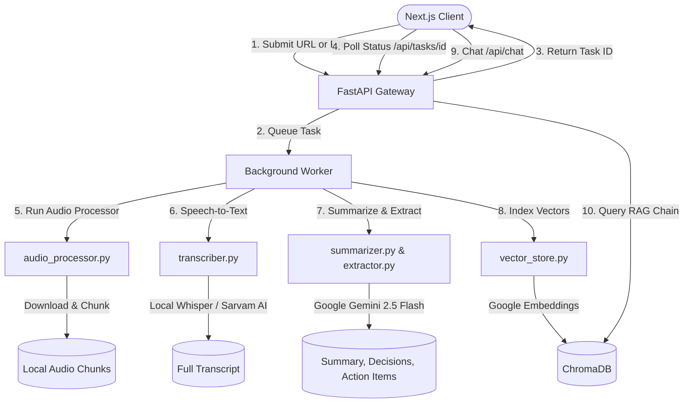

# 🎬 AI Video Assistant (Meeting Intelligence Agent)

AI Video Assistant is a complete, production-ready application designed to transform video recordings and meeting files into searchable, actionable knowledge. The system downloads audio from video files or YouTube links, transcribes speech, generates professional titles/summaries, extracts key decisions & action items, and hosts a local RAG (Retrieval-Augmented Generation) engine to let you converse with your meeting transcripts.

Built with a decoupled architecture featuring a **FastAPI backend** (using **Google Gemini AI**) and a highly responsive, modern **Next.js + Tailwind CSS** frontend dashboard.

---

## 🏛️ System Architecture

The application uses an asynchronous task-queue model to handle long-running transcription and AI analysis pipelines without request timeouts:



---

## ✨ Features

- **🧩 Decoupled Architecture**: FastAPI ASGI backend API server and Next.js SPA frontend web client.
- **🎙️ Dual Speech-to-Text Engines**: Local OpenAI Whisper for English, and Sarvam AI SaaS model for Hinglish meetings.
- **🧠 Google Gemini 2.5 Flash Integration**: Rapid summarization, title generation, and structured information extraction (decisions, checklists, follow-ups).
- **🔎 Local RAG Engine**: High-performance semantic indexing via `GoogleGenerativeAIEmbeddings` (`models/text-embedding-04`) and ChromaDB.
- **📊 Real-time Dashboard**:
  - URL analyzer input and local drag-and-drop file upload.
  - Active pipeline stepper tracking progress live (processing audio 🔊, transcribing 📝, summarising 📋, and indexing 🧠).
  - Multi-tab results viewer (formatted summaries, checkbox action items, metadata columns, and a macOS terminal style scrollable code-block transcript viewer).
  - Floating sidebar chat chatbot client with typing loaders.
- **🚀 Advanced Package Management**: Configured for Astrals' `uv` package manager for instant environment resolution.

---

## 📂 Project Directory Structure

```text
AI-Video-Assistant/
├── backend/               # FastAPI Backend Service
│   ├── core/              # AI and Database orchestration
│   │   ├── transcriber.py     # Speech-to-Text (Whisper / Sarvam AI)
│   │   ├── summarizer.py      # Map-Reduce Summaries & Titles (Gemini)
│   │   ├── extractor.py       # Decisions, Actions & Questions (Gemini)
│   │   ├── vector_store.py    # Chroma DB & Google GenAI Embeddings
│   │   └── rag_engine.py      # LCEL QA Retrieval Chain
│   ├── utils/             # Helper processing files
│   │   └── audio_processor.py # yt-dlp downloader and pydub chunker
│   ├── api.py             # FastAPI API gateway routes & background tasks
│   ├── app.py             # Legacy Streamlit alternative interface
│   ├── main.py            # CLI pipeline entrypoint
│   ├── test.py            # Raw pipeline CLI test script
│   ├── Requirements.txt   # Backend requirements
│   ├── .env               # Secrets configuration
│   └── .env.example       # Secrets template
├── frontend/              # Next.js App Router Web Client
│   ├── src/
│   │   ├── app/
│   │   │   ├── page.tsx          # Dashboard state controller & polling
│   │   │   ├── layout.tsx        # HTML wrapper
│   │   │   └── globals.css       # Obsidian theme setup, scrollbars & loaders
│   │   └── components/
│   │       └── views.tsx         # Home, Loading, Dashboard, and Error views
│   ├── package.json
│   └── tsconfig.json
└── README.md
```

---

## 🛠️ Step-by-Step Installation Guide

### Prerequisites
- **Python**: version `3.10` or `3.11` recommended.
- **Node.js**: version `18` or higher.
- **FFmpeg**: Required for audio chunking and processing.
  - *Windows*: Download from [ffmpeg.org](https://ffmpeg.org/), extract, and add the `bin` folder to your System `PATH`.
  - *macOS*: `brew install ffmpeg`
  - *Linux*: `sudo apt install ffmpeg`
- **uv** (Optional but highly recommended): Astral's fast Python package installer. Run `pip install uv`.

### 1. Backend Service Setup (FastAPI)

1. Open your terminal and navigate into the `backend/` directory:
   ```bash
   cd backend
   ```
2. Create a Python virtual environment and install the dependencies:
   - **Using `uv`** (takes ~5 seconds):
     ```bash
     uv venv
     uv pip install -r Requirements.txt
     ```
   - **Using standard `pip`**:
     ```bash
     python -m venv .venv
     # Windows:
     .venv\Scripts\activate
     # macOS/Linux:
     source .venv/bin/activate
     
     pip install -r Requirements.txt
     ```
3. Create your `.env` configuration file:
   ```bash
   cp .env.example .env
   ```
   Open the newly created `.env` file and insert your API keys:
   - `GOOGLE_API_KEY`: Your Google Gemini API token.
   - `SARVAM_API_KEY`: Your Sarvam AI STT token (if using Hinglish transcription).

### 2. Frontend Web Client Setup (Next.js)

1. Open a separate terminal window and navigate into the `frontend/` directory:
   ```bash
   cd frontend
   ```
2. Install npm packages:
   ```bash
   npm install
   ```

---

## 🏁 Running the Application

### Start the Backend API
From the `backend/` directory:
- **Using `uv`**:
  ```bash
  uv run uvicorn api:app --reload --port 8000
  ```
- **Using standard python**:
  Ensure your virtualenv is active, then run:
  ```bash
  uvicorn api:app --reload --port 8000
  ```
The API documentation will be available at `http://localhost:8000/docs`.

### Start the Frontend Web App
From the `frontend/` directory, run:
```bash
npm run dev
```
Open `http://localhost:3000` in your web browser.

---

## 🔌 API Documentation

### `POST /api/analyze`
Starts the async task analysis pipeline.
- **Request Payload**:
  ```json
  {
    "source": "https://www.youtube.com/watch?v=...",
    "language": "english"
  }
  ```
- **Response**:
  ```json
  {
    "task_id": "8f8373b9-1d4e-4f51-b841-dbf403be4110",
    "status": "pending",
    "message": "Analysis pipeline queued."
  }
  ```

### `GET /api/tasks/{task_id}`
Retrieves progress logs and results for a specific task.
- **Response (Success State)**:
  ```json
  {
    "status": "completed",
    "current_step": "done",
    "result": {
      "title": "Weekly Engineering Sync",
      "summary": "Bullet points...",
      "action_items": "Checklist items...",
      "key_decisions": "Decisions made...",
      "open_questions": "Open questions...",
      "transcript": "Raw transcript content..."
    }
  }
  ```

### `POST /api/chat`
Ask semantic questions against the loaded video transcript index.
- **Request Payload**:
  ```json
  {
    "task_id": "8f8373b9-1d4e-4f51-b841-dbf403be4110",
    "question": "What timeline did the team decide on?"
  }
  ```
- **Response**:
  ```json
  {
    "answer": "The team decided to target the public release by July 15th..."
  }
  ```
