# 🎬 FastAPI & Next.js Deployment Guide for AI Video Assistant

This guide explains how to migrate the existing Streamlit app ([app.py](file:///c:/Users/itsad/Desktop/AI-Video-Assistant--main/app.py)) into a scalable, decoupled architecture using **FastAPI** as the backend API and **Next.js** as the frontend web application.

---

## 🏛️ High-Level Architecture

Since processing and transcribing videos are long-running operations, the frontend cannot wait for a single synchronous HTTP request to complete. Instead, we use an **Asynchronous Task Polling** pattern:

```mermaid
sequenceDiagram
    participant User as Next.js Client
    participant API as FastAPI Gateway
    participant DB as Task Database (Memory/SQLite)
    participant Worker as Background Task
    participant Core as Core Pipeline (transcriber, summarizer, etc.)

    User->>API: 1. POST /api/analyze {source, language}
    API->>DB: 2. Initialize task (status="pending")
    API->>Worker: 3. Launch background pipeline task
    API-->>User: 4. Return {task_id, status="pending"}
    
    rect rgb(20, 20, 30)
        Note over Worker, Core: Running in Background
        Worker->>DB: Update status to "processing" & current_step
        Worker->>Core: Run audio processing & transcription
        Worker->>Core: Run LLM analysis (summary, extraction, vector DB)
        Worker->>DB: Update status to "completed" with results
    end

    loop Every 3 seconds
        User->>API: 5. GET /api/tasks/{task_id}
        API->>DB: Fetch task state
        API-->>User: Return current status & progress
    end
```



---

## 📂 Recommended Directory Layout

You can organize your files as follows to keep the backend and frontend code bases cleanly separated:

```text
AI-Video-Assistant/
├── core/                  # Core modules (Keep unchanged)
│   ├── transcriber.py
│   ├── summarizer.py
│   ├── extractor.py
│   ├── vector_store.py
│   └── rag_engine.py
├── utils/                 # Utilities (Keep unchanged)
│   └── audio_processor.py
├── api.py                 # NEW: FastAPI entrypoint & routes
├── Requirements.txt       # Updated with FastAPI, uvicorn
├── .env                   # Environment variables (API keys)
└── frontend/              # NEW: Next.js application
    ├── package.json
    ├── tailwind.config.js
    ├── src/
    │   ├── app/
    │   │   ├── page.tsx          # Main submit page
    │   │   ├── dashboard/
    │   │   │   └── page.tsx      # Results tab & Chatbot dashboard
    │   │   └── layout.tsx
    │   └── components/
    │       ├── ProgressStep.tsx  # Interactive Stepper component
    │       ├── ChatPanel.tsx     # RAG Chat interface
    │       └── DashboardTabs.tsx # Summary, Action Items tabs
```

---

## 🐍 Step 1: FastAPI Backend (`api.py`)

Here is the complete implementation code for the FastAPI backend (`api.py`). It integrates our existing core libraries: [audio_processor.py](file:///c:/Users/itsad/Desktop/AI-Video-Assistant--main/utils/audio_processor.py), [transcriber.py](file:///c:/Users/itsad/Desktop/AI-Video-Assistant--main/core/transcriber.py), [summarizer.py](file:///c:/Users/itsad/Desktop/AI-Video-Assistant--main/core/summarizer.py), [extractor.py](file:///c:/Users/itsad/Desktop/AI-Video-Assistant--main/core/extractor.py), and [rag_engine.py](file:///c:/Users/itsad/Desktop/AI-Video-Assistant--main/core/rag_engine.py).

### Install FastAPI Dependencies
Add these packages to your python environment or update your [Requirements.txt](file:///c:/Users/itsad/Desktop/AI-Video-Assistant--main/Requirements.txt):
```bash
pip install fastapi uvicorn pydantic
```

### Backend Code (`api.py`)
```python
import uuid
import logging
from fastapi import FastAPI, BackgroundTasks, HTTPException
from fastapi.middleware.cors import CORSMiddleware
from pydantic import BaseModel
from typing import Dict, Any, Optional
from dotenv import load_dotenv

# Import existing pipeline functions
from utils.audio_processor import process_input
from core.transcriber import transcribe_all
from core.summarizer import summarize, generate_title
from core.extractor import extract_action_items, extract_key_decisions, extract_questions
from core.rag_engine import build_rag_chain, ask_question

# Setup logging
logging.basicConfig(level=logging.INFO)
logger = logging.getLogger("AI-Video-Assistant-API")

load_dotenv()

app = FastAPI(
    title="AI Video Assistant API",
    description="Backend API endpoints for transcription, summarization, and RAG chat"
)

# Enable CORS for Next.js (usually runs on port 3000)
app.add_middleware(
    CORSMiddleware,
    allow_origins=["http://localhost:3000"],
    allow_credentials=True,
    allow_methods=["*"],
    allow_headers=["*"],
)

# In-memory storage for simplicity (SQLite or PostgreSQL should be used in production)
tasks_db: Dict[str, Dict[str, Any]] = {}
rag_chains_db: Dict[str, Any] = {}

class AnalysisRequest(BaseModel):
    source: str
    language: str = "english"

class ChatRequest(BaseModel):
    task_id: str
    question: str

def run_analysis_pipeline(task_id: str, source: str, language: str):
    """
    Executes the long-running analysis pipeline step-by-step 
    and updates the tasks database with logs and final results.
    """
    try:
        logger.info(f"Task {task_id}: Starting audio processing")
        tasks_db[task_id]["status"] = "processing"
        
        # Step 1: Audio Processing
        tasks_db[task_id]["current_step"] = "audio"
        chunks = process_input(source)
        
        # Step 2: Transcription
        logger.info(f"Task {task_id}: Starting transcription")
        tasks_db[task_id]["current_step"] = "transcript"
        transcript = transcribe_all(chunks, language)
        
        # Step 3: Title Generation
        logger.info(f"Task {task_id}: Generating title")
        tasks_db[task_id]["current_step"] = "title"
        title = generate_title(transcript)
        
        # Step 4: Summarization
        logger.info(f"Task {task_id}: Generating summary")
        tasks_db[task_id]["current_step"] = "summary"
        summary = summarize(transcript)
        
        # Step 5: Information Extraction
        logger.info(f"Task {task_id}: Extracting insights")
        tasks_db[task_id]["current_step"] = "extract"
        action_items = extract_action_items(transcript)
        decisions = extract_key_decisions(transcript)
        questions = extract_questions(transcript)
        
        # Step 6: RAG Engine Build
        logger.info(f"Task {task_id}: Building vector store & RAG chain")
        tasks_db[task_id]["current_step"] = "rag"
        rag_chain = build_rag_chain(transcript)
        rag_chains_db[task_id] = rag_chain
        
        # Complete
        logger.info(f"Task {task_id}: Analysis complete!")
        tasks_db[task_id]["status"] = "completed"
        tasks_db[task_id]["current_step"] = "done"
        tasks_db[task_id]["result"] = {
            "title": title,
            "transcript": transcript,
            "summary": summary,
            "action_items": action_items,
            "key_decisions": decisions,
            "open_questions": questions
        }
    except Exception as e:
        logger.error(f"Task {task_id} failed: {str(e)}", exc_info=True)
        tasks_db[task_id]["status"] = "failed"
        tasks_db[task_id]["error"] = str(e)

@app.post("/api/analyze")
def analyze(payload: AnalysisRequest, background_tasks: BackgroundTasks):
    """
    Submits a YouTube URL or file path for async background analysis.
    """
    if not payload.source.strip():
        raise HTTPException(status_code=400, detail="Source cannot be empty")
        
    task_id = str(uuid.uuid4())
    tasks_db[task_id] = {
        "status": "pending",
        "current_step": "init",
        "error": None,
        "result": None
    }
    
    background_tasks.add_task(
        run_analysis_pipeline, task_id, payload.source, payload.language
    )
    
    return {
        "task_id": task_id,
        "status": "pending",
        "message": "Analysis pipeline queued."
    }

@app.get("/api/tasks/{task_id}")
def get_task_status(task_id: str):
    """
    Returns progress and status of a specific task.
    """
    if task_id not in tasks_db:
        raise HTTPException(status_code=404, detail="Task not found")
    return tasks_db[task_id]

@app.post("/api/chat")
def chat_with_transcript(payload: ChatRequest):
    """
    Asks questions against the specific loaded video transcript vector store.
    """
    task_id = payload.task_id
    if task_id not in rag_chains_db:
        raise HTTPException(
            status_code=404, 
            detail="Active conversation session not found. Task might be processing, failed, or expired."
        )
    
    try:
        rag_chain = rag_chains_db[task_id]
        answer = ask_question(rag_chain, payload.question)
        return {"answer": answer}
    except Exception as e:
        raise HTTPException(status_code=500, detail=f"RAG Engine error: {str(e)}")

# Run command: uvicorn api:app --reload --port 8000
```

---

## ⚛️ Step 2: Next.js Frontend Setup

You can build a modern Next.js frontend with Tailwind CSS.

### 🔌 Client-Side API Integration (Next.js Hook)

Create a custom hook `useAnalysis.ts` to manage submission, loading, and polling of tasks.

```typescript
// frontend/src/hooks/useAnalysis.ts
import { useState, useEffect, useRef } from 'react';

export type TaskStatus = 'pending' | 'processing' | 'completed' | 'failed';
export type PipelineStep = 'init' | 'audio' | 'transcript' | 'title' | 'summary' | 'extract' | 'rag' | 'done';

export interface TaskResponse {
  status: TaskStatus;
  current_step: PipelineStep;
  error?: string;
  result?: {
    title: string;
    transcript: string;
    summary: string;
    action_items: string;
    key_decisions: string;
    open_questions: string;
  };
}

export function useAnalysis() {
  const [taskId, setTaskId] = useState<string | null>(null);
  const [taskData, setTaskData] = useState<TaskResponse | null>(null);
  const [loading, setLoading] = useState(false);
  const [error, setError] = useState<string | null>(null);
  
  const pollIntervalRef = useRef<NodeJS.Timeout | null>(null);

  const startAnalysis = async (source: string, language: string) => {
    setLoading(true);
    setError(null);
    setTaskData(null);
    setTaskId(null);

    try {
      const res = await fetch('http://localhost:8000/api/analyze', {
        method: 'POST',
        headers: { 'Content-Type': 'application/json' },
        body: JSON.stringify({ source, language })
      });
      
      if (!res.ok) throw new Error('Failed to start analysis');
      const data = await res.json();
      setTaskId(data.task_id);
    } catch (err: any) {
      setError(err.message || 'Something went wrong');
      setLoading(false);
    }
  };

  // Poll status endpoint
  useEffect(() => {
    if (!taskId) return;

    const checkStatus = async () => {
      try {
        const res = await fetch(`http://localhost:8000/api/tasks/${taskId}`);
        if (!res.ok) throw new Error('Failed to fetch status');
        
        const data: TaskResponse = await res.json();
        setTaskData(data);

        if (data.status === 'completed' || data.status === 'failed') {
          if (pollIntervalRef.current) clearInterval(pollIntervalRef.current);
          setLoading(false);
        }
      } catch (err: any) {
        setError(err.message);
        setLoading(false);
        if (pollIntervalRef.current) clearInterval(pollIntervalRef.current);
      }
    };

    // Initial check
    checkStatus();

    // Set polling interval
    pollIntervalRef.current = setInterval(checkStatus, 3000);

    return () => {
      if (pollIntervalRef.current) clearInterval(pollIntervalRef.current);
    };
  }, [taskId]);

  return { startAnalysis, taskId, taskData, loading, error };
}
```

### 💬 Chat Component Call
To send messages to `/api/chat`, use this request layout:
```typescript
const askQuestion = async (taskId: string, question: string) => {
  const res = await fetch('http://localhost:8000/api/chat', {
    method: 'POST',
    headers: { 'Content-Type': 'application/json' },
    body: JSON.stringify({ task_id: taskId, question })
  });
  const data = await res.json();
  return data.answer; // Answer response string
};
```

---

## 🛠️ Step 3: Production Improvements

If you deploy this setup to a cloud server or a production system, consider these additions:

1. **Persistent Task Store (SQLAlchemy & SQLite/Postgres)**:
   In-memory `tasks_db` resets whenever FastAPI restarts. Instead, write results to a lightweight SQLite database using SQLAlchemy.
2. **Celery Task Queue**:
   For scaling, use Celery with Redis/RabbitMQ instead of FastAPI's `BackgroundTasks`. This separates the web requests from heavy computation (Whisper transcription & Hugging Face embedding).
3. **Persisted Vector DB Directory**:
   Ensure ChromaDB saves its databases to a local persistent storage directory rather than memory or a temporary directory so that old meetings don't need re-indexing upon server restart.
4. **Environment File Configuration**:
   Ensure `.env` containing your `MISTRAL_API_KEY` is placed in the backend root directory.

---

## 🏁 How to Run Locally

### Backend
1. Save the backend code inside the root workspace as `api.py`.
2. Run:
   ```bash
   uvicorn api:app --reload --port 8000
   ```

### Frontend
1. Scaffold Next.js inside a `frontend` folder:
   ```bash
   npx create-next-app@latest frontend --typescript --tailwind --eslint
   ```
2. Run development server:
   ```bash
   cd frontend
   npm run dev
   ```
